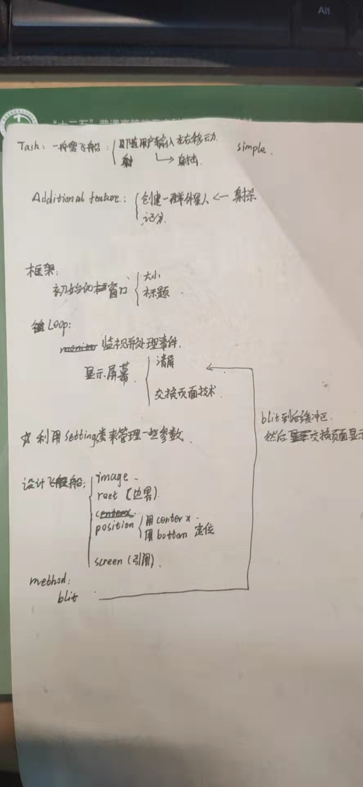

通过使用Pygame来处理在屏幕上绘制图像等任务，你不用考虑众多烦琐而艰难的编码工作，而是将重点放在程序的高级逻辑上。

开发大型项目时，做好规划后再动手编写项目很重要。规划可确保你不偏离轨道，从而提高项目成功的可能性。

## 宏观

在游戏《外星人入侵》中，玩家控制着一艘最初出现在屏幕底部中央的飞船。玩家可以使用箭头键左右移动飞船，还可使用空格键进行射击。游戏开始时，一群外星人出现在天空中，他们在屏幕中向下移动。玩家的任务是射杀这些外星人。玩家将所有外星人都消灭干净后，将出现一群新的外星人，他们移动的速度更快。只要有外星人撞到了玩家的飞船或到达了屏幕底部，玩家就损失一艘飞船。玩家损失三艘飞船后，游戏结束。


## install

`pip install pygame`

可见到是封装了 SDL

## 框架

游戏程序的参数放到 settings 类里面

例如，窗口的大小，背景颜色

贴图

为游戏选择素材时，务必要注意许可。最安全、最不费钱的方式是使用http://pixabay.com/等网站提供的图形，这些图形无需许可，你可以对其进行修改。


## notice

注重模块化 module 

采用发送消息的方法来控制飞船，改变飞船的状态来控制飞船的移动


## python more

[super1](https://realpython.com/python-super/)

[super2](https://mozillazg.com/2016/12/python-super-is-not-as-simple-as-you-thought.html)


对 Group 的实现机制感到好奇 --> 其实就是一个动态链表


对编组调用draw()时，Pygame自动绘制编组的每个元素，绘制位置由元素的属性rect决定。在这里，aliens.draw(screen)在屏幕上绘制编组中的每个外星人。

看了看sprite，原来sprite里面的update（self，*args，**kwargs）会遍历方式调用update（*args， **kwargs）


## struct



**refactor**


新增的这行代码遍历编组bullets中的每颗子弹，再遍历编组aliens中的每个外星人。每当有子弹和外星人的rect重叠时，groupcollide()就在它返回的字典中添加一个键-值对。两个实参True告诉Pygame删除发生碰撞的子弹和外星人。（要模拟能够穿行到屏幕顶端的高能子弹——消灭它击中的每个外星人，可将第一个布尔实参设置为False，并让第二个布尔实参为True。这样被击中的外星人将消失，但所有的子弹都始终有效，直到抵达屏幕顶端后消失。）


# Look for alien-ship collisions.
    if pygame.sprite.spritecollideany(ship, aliens)

```
为测试创建大子弹
只需通过运行这个游戏就可以测试其很多功能，但有些功能在正常情况下测试起来比较烦琐。例如，要测试代码能否正确地处理外星人编组为空的情形，需要花很长时间将屏幕上的外星人都击落。
测试有些功能时，可以修改游戏的某些设置，以便专注于游戏的特定方面。例如，可以缩小屏幕以减少需要击落的外星人数量，也可以提高子弹的速度，以便能够在单位时间内发射大量子弹。
测试这个游戏时，我喜欢做的一项修改是增大子弹的尺寸，使其在击中外星人后依然有效。请尝试将bullet_width设置为300，看看将所有外星人都射杀有多快！
类似这样的修改可提高测试效率，还可能激发出如何赋予玩家更大威力的思想火花。（完成测试后，别忘了将设置恢复正常。）

觉得这才是程序的快乐，可以随心所欲地修改，随着自己的想象而奔驰

```

