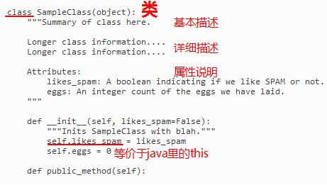

# class

## class comment




约定 类的首字母  大写

## 构造函数

`__init__(self, args)`

### args -> self

It does not have to be named self , you can call it whatever you like, but it has to be the first parameter of any function in the class

```python
class Person:
  def __init__(mysillyobject, name, age):
    mysillyobject.name = name
    mysillyobject.age = age

  def myfunc(abc):
    print("Hello my name is " + abc.name)

p1 = Person("John", 36)
p1.myfunc()
```

## delete object properties

del object.properties

## delete object

del object


修改属性的方法：

1. 访问实例属性进行修改


2. 通过方法进行设置


## [继承](https://www.w3schools.com/python/python_inheritance.asp)


### notice

注意区分类的关系----> 组合(包含关系)和继承

```python
class Car():
    pass
class Battery(): 
    def __init__(self, battery_size=70): 
        pass

# ElectricCar 继承自 car
# ElectricCar 包含 Battery
class ElectricCar(Car):
    def __init__(self, make, model, year):
        super().__init__(make, model, year)
        self.battery = Battery() 

my_tesla = ElectricCar('tesla', 'model s', 2016)
print(my_tesla.get_descriptive_name())
my_tesla.battery.describe_battery()
```


使用代码模拟实物时，你可能会发现自己给类添加的细节越来越多：属性和方法清单以及文件都越来越长。在这种情况下，可能需要将类的一部分作为一个独立的类提取出来。你可以将大型类拆分成多个协同工作的小类。


解决上述问题时，你从较高的逻辑层面（而不是语法层面）考虑；你考虑的不是Python，而是如何使用代码来表示实物。到达这种境界后，你经常会发现，现实世界的建模方法并没有对错之分。有些方法的效率更高，但要找出效率最高的表示法，需要经过一定的实践。只要代码像你希望的那样运行，就说明你做得很好！即便你发现自己不得不多次尝试使用不同的方法来重写类，也不必气馁；要编写出高效、准确的代码，都得经过这样的过程。


通过将这个类移到一个模块中，并导入该模块，你依然可以使用其所有功能，但主程序文件变得整洁而易于阅读了。这还能让你将大部分逻辑存储在独立的文件中；确定类像你希望的那样工作后，你就可以不管这些文件，而专注于主程序的高级逻辑了。

这句话是比较重要的，面向对象程序设计主要就是解决给函数分类的问题，不同类的函数分开存放，更进一步解决的问题是，易于程序员使用和阅读，说来说去编程目的除了精确地告诉计算机处理器怎么工作，剩下的就是便于人阅读和使用，定义明白的函数名、分类存档等等主要都是为了人便于阅读，可能也是因为这个原因吧，中文翻译过来的面向对象语言的主体就叫做“类”，可以说面向对象主要解决的就是各种函数分类存档的问题


一开始应让代码结构尽可能简单。先尽可能在一个文件中完成所有的工作，确定一切都能正确运行后，再将类移到独立的模块中。如果你喜欢模块和文件的交互方式，可在项目开始时就尝试将类存储到模块中。先找出让你能够编写出可行代码的方式，再尝试让代码更为组织有序。


就是原文所说的那样，一开始先保证代码能够完成预期的工作，在此基础上逐渐增加新功能，重构代码提升可用性，优化性能。重要的是尽快拿出一个可用的东西，而不是一直停留在构思阶段。


Python Module of the Week：要了解Python标准库，一个很不错的资源是网站Python Module of the Week。请[访问](http://pymotw.com/)并查看其中的目录，在其中找一个你感兴趣的模块进行探索，或阅读模块collections和random的文档。


类名应采用驼峰命名法，即将类名中的每个单词的首字母都大写，而不使用下划线。实例名和模块名都采用小写格式，并在单词之间加上下划线。
对于每个类，都应紧跟在类定义后面包含一个文档字符串。这种文档字符串简要地描述类的功能，并遵循编写函数的文档字符串时采用的格式约定。每个模块也都应包含一个文档字符串，对其中的类可用于做什么进行描述。
可使用空行来组织代码，但不要滥用。在类中，可使用一个空行来分隔方法；而在模块中，可使用两个空行来分隔类。
需要同时导入标准库中的模块和你编写的模块时，先编写导入标准库模块的import语句，再添加一个空行，然后编写导入你自己编写的模块的import语句。